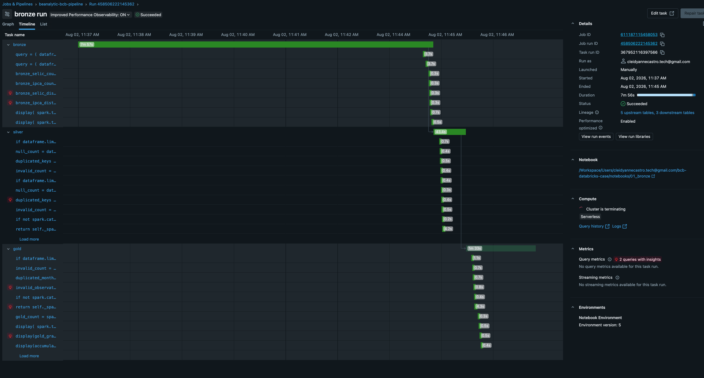
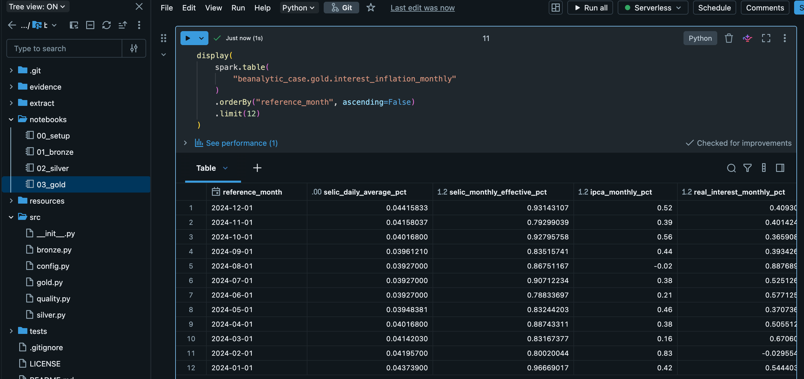

# BCB Interest and Inflation Databricks Pipeline

## Overview

This project implements an end-to-end data pipeline in Databricks using public economic time series from Banco Central do Brasil.

The objective is to create an analytical monthly dataset that compares the cost of money, represented by the SELIC rate, with inflation, represented by IPCA.

The project uses a Medallion Architecture with Bronze, Silver, and Gold layers, Delta Lake tables, Unity Catalog, Auto Loader, data-quality validations, idempotent loads, and orchestration through Databricks Workflows.

## Data Sources

The pipeline processes two public series from the Banco Central do Brasil SGS API:

| Dataset | SGS Series | Frequency | Period |
|---|---:|---|---|
| SELIC | 11 | Daily | January 2020 to December 2024 |
| IPCA | 433 | Monthly | January 2020 to December 2024 |

Both endpoints return records containing a date in `dd/MM/yyyy` format and a numeric value represented as a string.

## Architecture

The data flow follows this sequence:

**Banco Central API → Local Python extraction → Unity Catalog Volume → Bronze Delta tables → Silver Delta tables → Gold analytical table**

The API extraction runs outside Databricks because Databricks Free Edition restricts outbound internet access.

The raw JSON files are uploaded manually to a Unity Catalog Volume and processed from there by the Databricks pipeline.

## Repository Structure

| Directory or file | Purpose |
|---|---|
| `extract/` | Local Python extraction script |
| `src/` | Modular PySpark pipeline logic |
| `notebooks/` | Databricks notebooks used by the Workflow |
| `resources/` | Databricks Workflow definition |
| `evidence/` | Execution and idempotency evidence |
| `tests/` | Reserved directory for automated tests |
| `requirements.txt` | Local extraction dependencies |
| `README.md` | Project documentation |

## Local Extraction

The local extraction script is available at `extract/extract_bcb.py`.

It performs the following operations:

- requests both BCB API endpoints;
- applies connection and read timeouts;
- retries failed requests;
- uses exponential backoff;
- validates the HTTP response;
- validates the returned JSON payload;
- fails explicitly when the API returns no records;
- writes the files using atomic replacement.

### Running the extraction

Clone the repository and access its directory.

Create a virtual environment with `python3 -m venv .venv`.

Activate it on macOS or Linux with `source .venv/bin/activate`.

Install the dependencies with `pip install -r requirements.txt`.

Run the extraction with `python -m extract.extract_bcb`.

The script generates:

- `data/raw/selic.json`
- `data/raw/ipca.json`

## Databricks Setup

The project uses the following Unity Catalog objects:

| Object | Name |
|---|---|
| Catalog | `beanalytic_case` |
| Landing schema | `beanalytic_case.landing` |
| Bronze schema | `beanalytic_case.bronze` |
| Silver schema | `beanalytic_case.silver` |
| Gold schema | `beanalytic_case.gold` |
| Raw-file Volume | `beanalytic_case.landing.raw_files` |

Run the `notebooks/00_setup` notebook to create the required catalog, schemas, and Volume.

After running the local extraction, upload the generated files to these Volume directories:

- SELIC: `/Volumes/beanalytic_case/landing/raw_files/selic/`
- IPCA: `/Volumes/beanalytic_case/landing/raw_files/ipca/`

The pipeline reads the files from the Volume rather than calling the API from Databricks.

## Bronze Layer

The Bronze layer is implemented in `src/bronze.py` and executed through `notebooks/01_bronze`.

It uses Databricks Auto Loader with an available-now trigger to perform incremental file ingestion.

The following Delta tables are created:

- `beanalytic_case.bronze.selic`
- `beanalytic_case.bronze.ipca`

The original API fields are preserved as strings.

Additional metadata includes:

- series name;
- source filename;
- source path;
- ingestion timestamp;
- ingestion date.

Separate Auto Loader checkpoints are maintained for SELIC and IPCA.

These checkpoints prevent previously processed files from being ingested again.

## Silver Layer

The Silver layer is implemented in `src/silver.py` and executed through `notebooks/02_silver`.

The following Delta tables are created:

- `beanalytic_case.silver.selic`
- `beanalytic_case.silver.ipca`

The layer performs:

- date parsing;
- decimal conversion;
- schema standardization;
- null validation;
- duplicate removal;
- rate-range validation;
- idempotent Delta MERGE operations.

### Business keys

| Table | Business key |
|---|---|
| Silver SELIC | `reference_date` |
| Silver IPCA | `reference_month` |

Records with null or unparsable business keys and rates cause the pipeline to fail explicitly.

Financial observations are not silently discarded or imputed.

## Gold Layer

The Gold layer is implemented in `src/gold.py` and executed through `notebooks/03_gold`.

It creates the consolidated table:

`beanalytic_case.gold.interest_inflation_monthly`

### Grain

The Gold table contains one record per calendar month for which valid SELIC and IPCA observations are available.

Its business key is `reference_month`.

### Metrics

The table includes:

- average daily SELIC rate in the month;
- effective monthly SELIC rate;
- monthly IPCA rate;
- monthly real interest rate;
- accumulated SELIC rate over 12 months;
- accumulated IPCA rate over 12 months;
- accumulated real interest rate over 12 months;
- number of SELIC daily observations in each month.

## Financial Calculations

### Average monthly SELIC

The arithmetic average of the daily SELIC observations is calculated for each month.

### Effective monthly SELIC

The daily SELIC rates are compounded within each calendar month to obtain an effective monthly rate.

### Monthly real interest rate

The monthly real interest rate is calculated using the Fisher relation:

**Real rate = ((1 + monthly SELIC) / (1 + monthly IPCA)) - 1**

### Twelve-month accumulated rates

Monthly SELIC and IPCA rates are compounded over a chronological rolling window of 12 months.

The accumulated real interest rate is calculated from the accumulated nominal SELIC and accumulated IPCA rates.

The first 11 months contain null accumulated values because a complete 12-month observation window is not yet available.

## Data Quality

The pipeline contains explicit data-quality validations across the processing layers.

The Job fails when any of the following conditions is detected:

1. An input dataset is empty.
2. A business key is null.
3. A required rate is null or cannot be parsed.
4. A business key is duplicated.
5. A rate is outside the expected range.
6. A Gold month has no SELIC daily observations.
7. The Gold table contains more than one record for the same month.

These checks are implemented in the modular Python source files and are executed as part of the Databricks Workflow.

## Workflow

The pipeline is orchestrated through a Databricks Workflow named `beanalytic-bcb-pipeline`.

The task dependency chain is:

**bronze → silver → gold**

Each task starts only after the previous task succeeds.

The Workflow definition is versioned in:

`resources/bcb_job.json`

The notebook paths in the exported JSON reflect the original workspace location and may need to be adjusted when the repository is imported into another Databricks workspace.

## Idempotency

The complete Workflow was executed multiple times without changing the raw input files.

The resulting row counts remained stable:

| Table | Total rows | Distinct business keys |
|---|---:|---:|
| Bronze SELIC | 1,255 | 1,255 |
| Bronze IPCA | 60 | 60 |
| Silver SELIC | 1,255 | 1,255 |
| Silver IPCA | 60 | 60 |
| Gold monthly | 60 | 60 |

Idempotency is achieved through:

- Auto Loader checkpoints in Bronze;
- Delta MERGE by `reference_date` in Silver SELIC;
- Delta MERGE by `reference_month` in Silver IPCA;
- Delta MERGE by `reference_month` in Gold.

## Execution Evidence

### Successful Workflow execution

### Idempotency validation

### Gold table sample

## Backfill Strategy

A historical backfill can be performed using the following process:

1. Configure the desired date range in the local extraction script.
2. Run the local extractor.
3. Save the result using a new and unique raw filename.
4. Upload the new file to the corresponding Unity Catalog Volume directory.
5. Run the Databricks Workflow.

Auto Loader detects files that have not previously been processed.

The Silver MERGE operations insert new business dates and update existing dates without creating duplicates.

The Gold table is recalculated from the complete Silver datasets and merged using `reference_month`.

## Reproducing the Project

To reproduce the solution from the beginning:

1. Clone the GitHub repository.
2. Create and activate a Python virtual environment.
3. Install the dependencies from `requirements.txt`.
4. Run the local BCB extraction script.
5. Import or clone the repository into Databricks.
6. Run `notebooks/00_setup`.
7. Upload `selic.json` and `ipca.json` to their respective Volume directories.
8. Confirm that the notebook paths in the Workflow point to the imported repository.
9. Run the Bronze, Silver, and Gold tasks through the Databricks Workflow.
10. Validate the final tables and business-key counts.

## Technical Decisions

### Local API extraction

The BCB API extraction runs locally because Databricks Free Edition restricts outbound access to external domains.

This approach also makes the extraction independently reproducible.

### Unity Catalog Volume

The Volume stores raw input files and Auto Loader checkpoints in governed Unity Catalog storage.

### Raw preservation in Bronze

The original source fields remain strings in Bronze to preserve the received data before business transformations.

### Explicit schemas

Explicit schemas are used instead of relying on automatic schema inference.

### Incremental ingestion

Auto Loader and separate checkpoints provide incremental and repeatable ingestion.

### Idempotent transformations

Silver and Gold use Delta MERGE operations based on declared business keys.

### Global rolling window

The rolling 12-month calculation uses a global chronological window because the dataset represents a single Brazilian national time series.

The warning about a non-partitioned Spark window is acceptable for this dataset, which contains only 60 monthly records.

### No physical Gold partitioning

The Gold table is small, so physical partitioning would add unnecessary complexity and potentially create many small files.

## Known Limitations

- Uploading the raw JSON files to the Unity Catalog Volume is currently manual.
- The extraction date range is configured in the local Python script.
- The exported Workflow JSON contains workspace-specific notebook paths.
- Automated unit tests are not yet implemented.
- The project does not use Lakeflow Declarative Pipelines or a Databricks Asset Bundle.

## Possible Improvements

Future improvements could include:

- automated upload through the Databricks CLI or SDK;
- deployment through a Databricks Asset Bundle;
- declarative data-quality expectations using Lakeflow Declarative Pipelines;
- automated unit and integration tests;
- parameterized extraction date ranges;
- scheduled Workflow execution;
- monitoring and alerting for failed data-quality checks.

## Technologies

- Python
- PySpark
- SQL
- Databricks
- Delta Lake
- Unity Catalog
- Auto Loader
- Databricks Workflows
- Git and GitHub